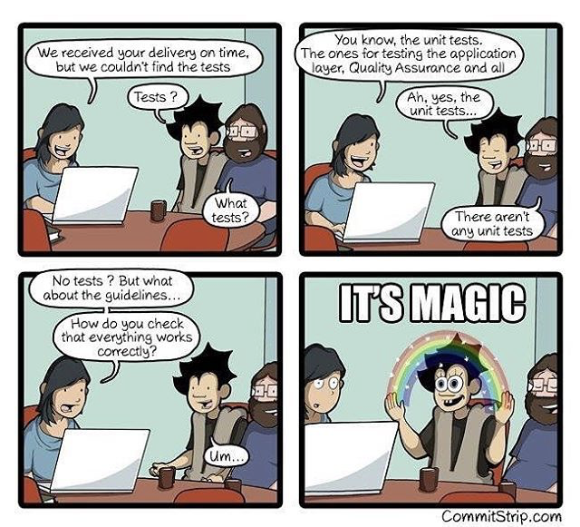

# Angular Jest  Unit Testing Examples


## Prerequisite

angular cli 11.2.14

node 12.15.0

## Jest Installation 
ng add @briebug/jest-schematic

little bug to manage here 

change

``` import 'jest-preset-angular' ```

in setup-jest  to


``` import 'jest-preset-angular/setup-jest'; ```

## Testing 

[Form example](./blob/master/src/app/todo-form/todo-form.component.spec.ts)
[Component](./blob/master/src/app/button/button.component.spec.ts)
[Service](./blob/master/src/app/services/api.service.spec.ts)
[Content Projection](./blob/master/src/app/table/table.component.spec.ts)

##  Tools 

[Majestic Jest UI](https://github.com/Raathigesh/majestic)
```
npm install majestic -g 
```

[VsCode Extension jestRunIt](https://marketplace.visualstudio.com/items?itemName=vespa-dev-works.jestRunIt)


 